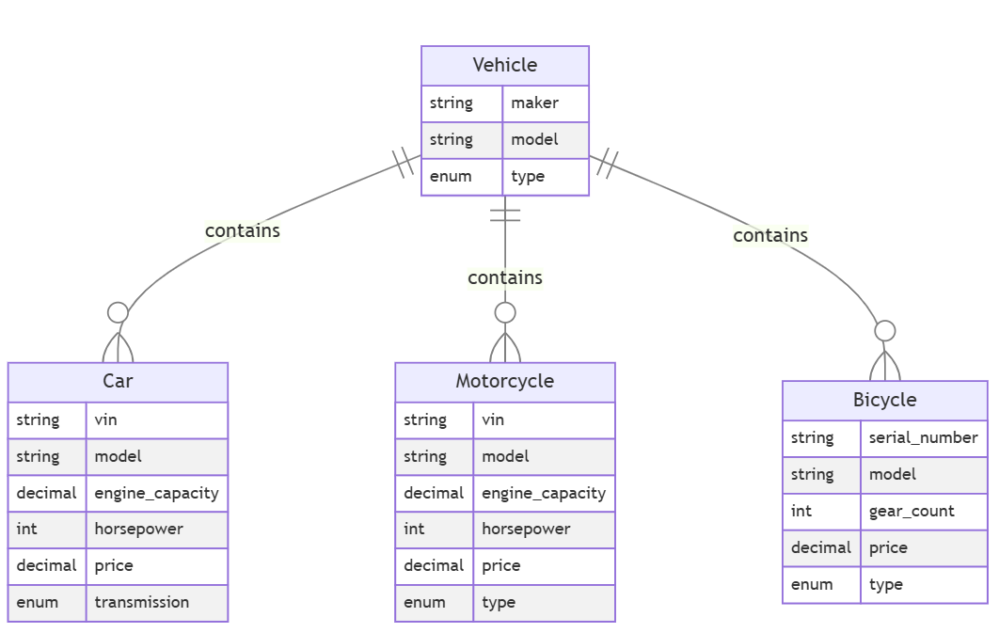
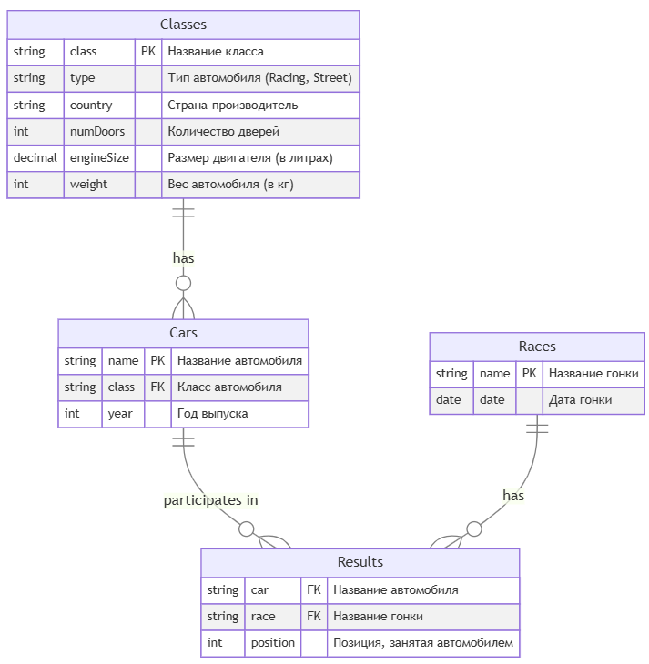
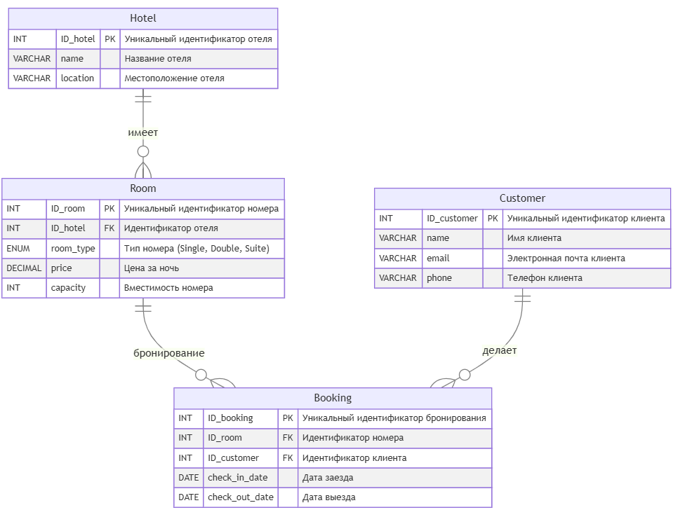
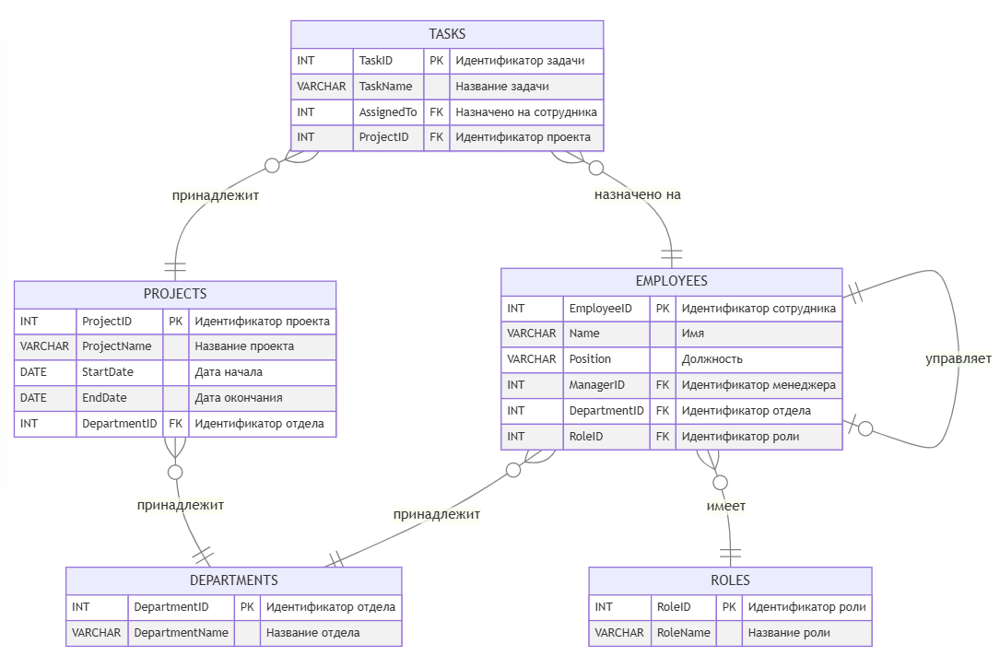

# Домашнее задание по SQL для магистратуры МИФИ

Задание выполнено с базой postgres, поднятой в контейнере docker.
Для воспроизведения понадобится docker compose, демон докера или colima.

```
cp db.example.env db.env
docker compose up -d
```

До базы можно достучаться localhost:5432
Скрипты запускать как удобно, если нужно - могу в соседнем контейнере поднять pgAdmin.

### Схема бд для первого задания


### Схема бд для второго задания


### Схема бд для третьего задания


### Схема бд для четвертого задания

